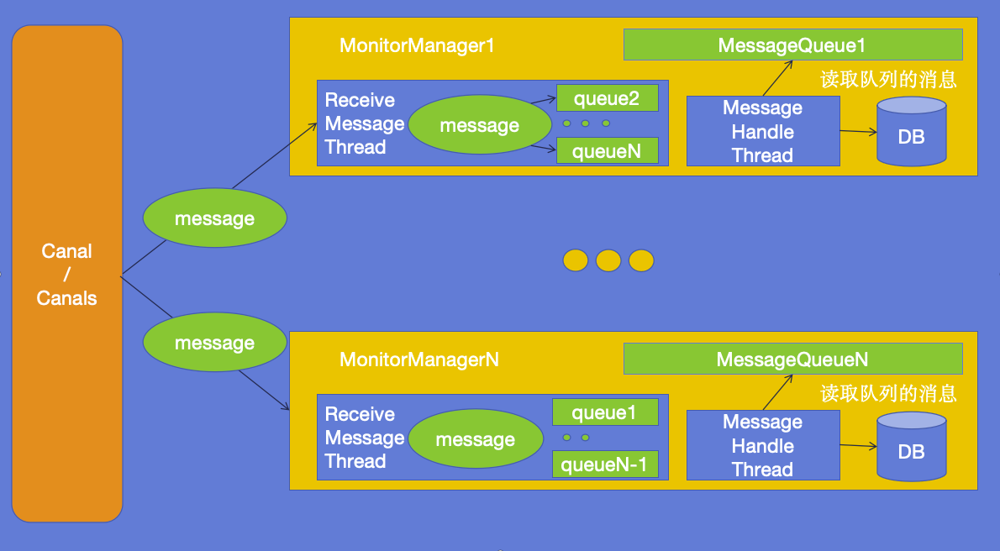

# Mysql数据同步程序

基于canal的数据同步程序

<font color=red>注: 不支持 create 操作的同步; 单条语句更改的数据行尽量少</font>



## config.json 配置说明

```js
{
  "redisConfig": {
    "hostname": "localhost",  // redis 的主机名/ip地址
    "port": 6379,  // redis 的端口
    "password": ""  // redis 的密码
  },
  "monitorConfigs": [  // 监听器的配置, 每个 destination 
    {
      "canalConfig": {  // 连接的canal配置
        "hostname": "localhost",  // canal 的连接地址
        "port": 11111,  // canal 监听的端口
        "destination": "xxxA",  // 对应canal配置中destinations中的xxxA
        "username": "",  // canal 连接的用户名
        "password": "",  // canal 连接的密码
        "subscribe": "DB_NAME.*"  // 需要监听的数据库更改bin-log信息
      },
      "dbConfig": {  // 需要同步的数据库配置
        "hostname": "localhost",  // 数据库地址
        "port": 3306,  // 数据库端口
        "database": "DB_NAME", // 数据库名称
        "username": "USERNAME",  // 用户名
        "password": "PWD",  // 密码
        // 连接池配置, 参考HikariCP的配置, 可忽略
        "maximumPoolSize": 20,
        "minimumIdle": 5,
        "idleTimeout": 60000,
        "connectionTimeout": 30000,
        "leakDetectionThreshold": 15000
      }
    }
  ],
  "dataSourceConfig": {  // 此软件需要的数据库配置, 用于存放同步错误日志, 数据表结构位于同目录下的 initTable.sql
    "hostname": "localhost",  // 数据库地址
    "port": 3306,  // 数据库端口
    "database": "DB_NDB_NAME", //数据库名称
    "username": "USERNAME",  // 连接使用的用户
    "password": "PWD"  // 连接使用的密码
  },
  "alarmPushConfig": {  // 错误日志HTTP报警推送, 可选项
    "userIds": [], // 需要推送的人员ID
    "url": "URL"  // 推送地址
  }
}

```


## 开发测试

- java 版本

  ```
  java version "17.0.10" 2024-01-16 LTS
  Java(TM) SE Runtime Environment (build 17.0.10+11-LTS-240)
  Java HotSpot(TM) 64-Bit Server VM (build 17.0.10+11-LTS-240, mixed mode, sharing)
  ```

- canal 版本

  ```
  canal-1.1.8-alpha-3
  下载地址: https://github.com/alibaba/canal/releases/download/canal-1.1.8-alpha-3/canal.deployer-1.1.8-SNAPSHOT.tar.gz
  ```

  

1. 安装依赖

   ```shell
   mvn clean install
   ```

2. 打包

   ```shell
   mvn clean package
   ```

3. 运行

   ```shell
   java -jar datasync.jar
   ```

## canal 配置

1. 进入canal/conf目录修改 canal.properties 文件如下内容

   ```ini
   # 查看端口是否为 11111
   canal.port = 11111
   
   # 查看服务类型是否为tcp
   canal.serverMode = tcp
   
   # 修改需要监控的destinations, 多个: xxxA,xxxB
   canal.destinations = xxxA
   ```

2. 添加上述 destinations 中的配置文件目录

   1. 在canal/conf目录下拷贝example目录为 xxxA(多个destinations同下),<font color=red> 此处的文件夹名需要与上述提到的destinations配置中一一对应</font>

      ```shell
      copy -R example/ xxxA
      ```

   2. 修改xxxA目录中的instance.properties文件的如下内容(多个destinations同下)

      ```ini
      # 从机的服务ID, 自定义, 不重复即可
      canal.instance.mysql.slaveId=1001   
      
      # 配置需要监听的数据库的地址
      canal.instance.master.address=host:port
      
      # 数据库的用户信息
      canal.instance.dbUsername=USERNAME
      canal.instance.dbPassword=PASSWORD
      ```

3. 启动canal

   1. 进入canal/bin目录

   2. 启动

      1. windows

         ```shell
         cd canal/bin
         双击运行 startup.bat
         ```
      
      2. linux
      
         ```shell
         cd canal/bin
         chmod +X startup.sh
	      ./startup.sh
         ```
      
      
      
## mysql 开启bin-log

1. 修改mysql配置文件为如下内容

   1. Windows 修改 my.ini

      ```ini
      # 开启 mysql bin-log 日志, 并且指定文件名为mysql-bin, 默认存放路径为mysql的data目录, 可自定义存放目录, 目录所属需为 mysql:mysql
      log_bin=mysql-bin 
      
      # bin-log 格式, 可选有 STATEMENT(语句级别), ROW(数据行级), MIXED(混合模式) 三种格式, 默认使用ROW
      binlog_format=row 
      
      # 从机服务ID, 自定义, 不重复即可
      server-id=100 
      
      # 需要开启bin-log的数据库, 多个数据库再起一行填写 binlog-do-db=db2
      binlog-do-db=db1
      
      ```

   2. Linux 修改 my.cnf 或者自定义的mysql配置文件

      ```ini
      # 开启 mysql bin-log 日志, 并且指定文件名为mysql-bin, 默认存放路径为mysql的data目录, 可自定义存放目录, 目录所属需为 mysql:mysql
      log_bin=mysql-bin 
      
      # bin-log 格式, 可选有 STATEMENT(语句级别), ROW(数据行级), MIXED(混合模式) 三种格式, 默认使用ROW
      binlog_format=row 
      
      # 从机服务ID, 自定义, 不重复即可
      server-id=100 
      
      # 需要开启bin-log的数据库, 多个数据库再起一行填写 binlog-do-db=db2
      binlog-do-db=db1
      ```

2. 重启mysql服务

3. 查看是否开启成功

   1. 进入数据库

      ```shell
      mysql -u USER -P
      ```

   2. 查看相关信息

      ```sql
      show variables like '%log_bin%'
      ```

   3. 显示如下内容即为开启

      | Variable_name | Value |
      | ------------- | ----- |
      | log_bin | ON |
      | log_bin_basename | /data/mysql/mysql-bin |
      | log_bin_index | /data/mysql/mysql-bin.index |
      | sql_log_bin | ON |


